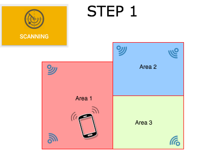
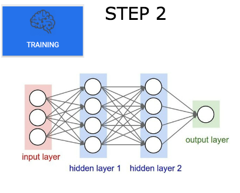
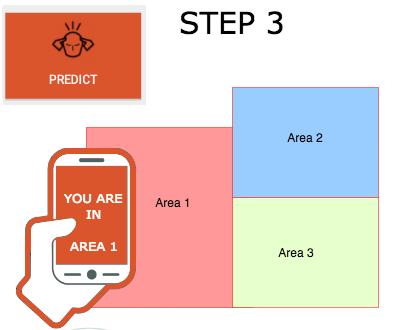
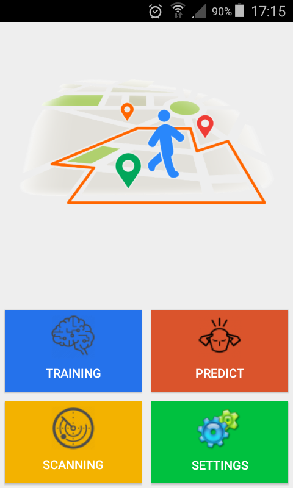
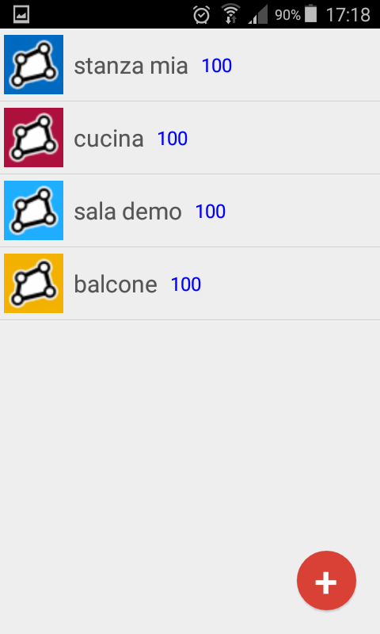
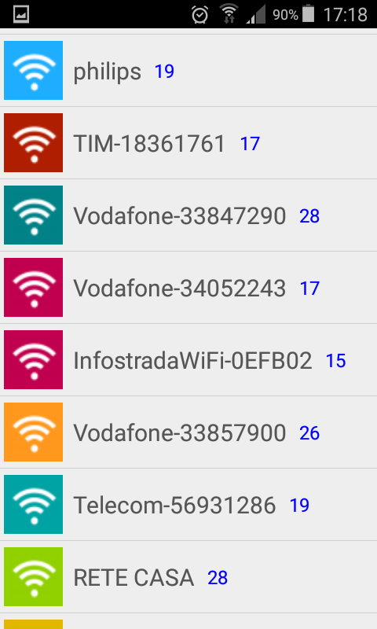

# FenceIndoor

<table border="0" width="100%">
<tr><td>

</td><td>
Step 1: 
...
</td></tr>
<tr><td>

</td><td>
Step 2: 
....
</td></tr>
<tr><td>

</td><td>
Step 3: 
....
</td></tr>
</table>

Sceenshots
<table border="0" width="100%">
<tr><td>

</td><td>

</td><td>

</td><td>

</td></tr>
</table>

From the project directory..

- Generate apk:

> cd FendeIndoorApp

> ./gradlew assemble

made apk to the path:

> ./FendeIndoorApp/app/build/outputs/apk/app-release-unsigned.apk

- Start server:

> cd FenceIndoorServer
> python fenceIndoor.py

