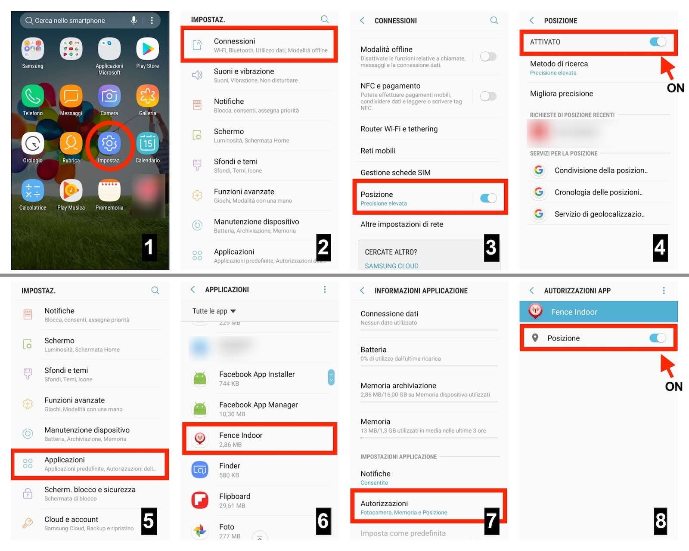
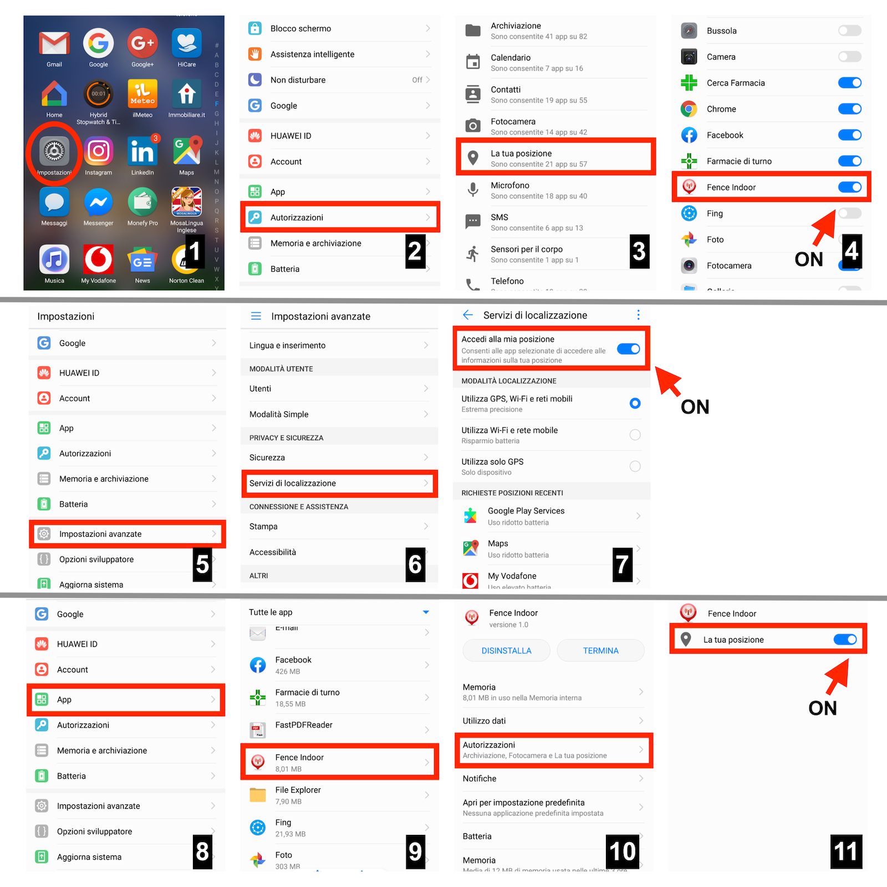
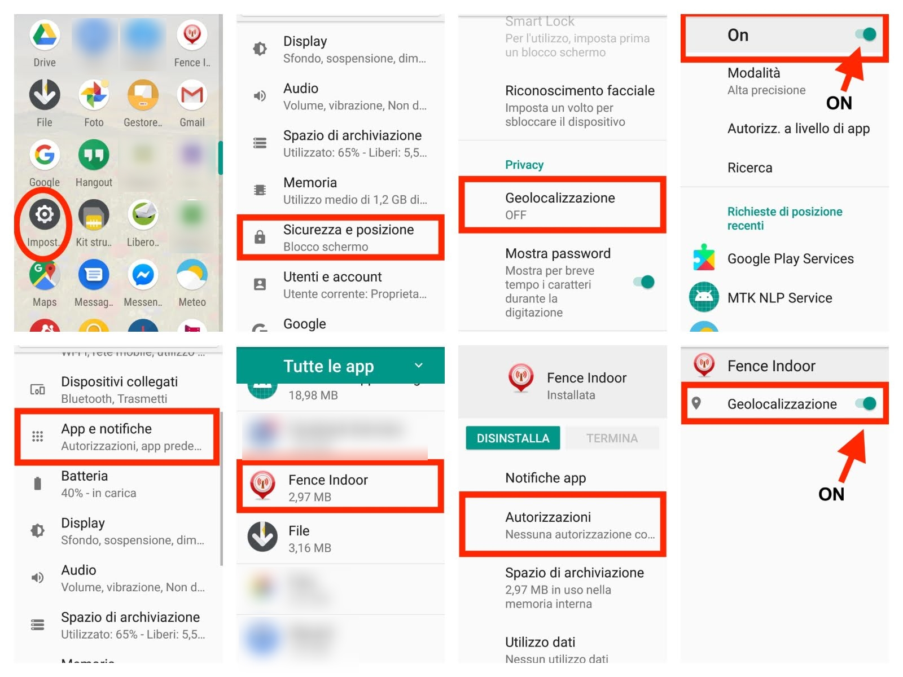

# FenceIndoor
..explained in three simple steps:

<br>
<table border="0" width="100%">
<tr><td>
<a href="Screenshots/step1.png"></a>
</td><td valign=top>
Step 1:<br>
Select the area you are in and capture all WiFi signals around device
</td></tr>
<tr><td>
<a href="Screenshots/step2.png"></a>
</td><td valign=top>
Step 2:<br>
Train the artificial neural network with the collected data
</td></tr>
<tr><td>
<a href="Screenshots/step3.png"></a>
</td><td valign=top>
Step 3:<br>
As you move the neural network will make a prediction of the area you are in, 
depending on the wifi signals caught around the device
</td></tr>
</table>
<br>

## Sceenshots:

<br>
<table border="0" width="100%">
<tr><td>
<a href="Screenshots/home.png"></a>
</td><td>
<a href="Screenshots/areaList.png"></a>
</td><td>
<a href="Screenshots/wifiScans.png"></a>
</td><td>
<a href="Screenshots/predict.png"></a>
</td></tr>
</table>
<br><br>

<br>


## Course:

<!--table border="0" width="100%">
<tr><td>
To have more explanations about the code follow the project udemy course:
</td></tr>
<tr><td>
<a href="https://www.udemy.com/course/practical-deep-learning-geolocalizzazione-indoor/?couponCode=CODE500019091"></a>
</td></tr>
<tr><td>
<a href="https://www.udemy.com/course/practical-deep-learning-geolocalizzazione-indoor/?couponCode=CODE500019091">https://www.udemy.com/course/practical-deep-learning-geolocalizzazione-indoor</a>
</td></tr>
</table-->

<table border="0" width="100%">
<tr><td>
To have more explanations about the code follow the project udemy course:
</td></tr>
<tr><td>
<a href="https://www.udemy.com/course/practical-deep-learning-geolocalizzazione-indoor/?couponCode=CODE100019091"></a>
</td></tr>
<tr><td>
<a href="https://www.udemy.com/course/practical-deep-learning-geolocalizzazione-indoor/?couponCode=CODE100019091">https://www.udemy.com/course/practical-deep-learning-geolocalizzazione-indoor</a>
</td></tr>
</table>

# Installation:

## Installation Mobile App:

From the project directory..

#### Build android app:

if you use AndroidStudio 
open project folder "FenceIndoorApp"

..otherwise use following command:

```
cd FenceIndoorApp
./gradlew build
```

#### Generate apk:

for generate apk still use gradle wrapper:
```
cd FenceIndoorApp
./gradlew assemble
```

made apk to the path:

```
./FenceIndoorApp/app/build/outputs/apk/app-release-unsigned.apk
```
rename it and transfer it into your mobile device


..if you want, you can download the apk directly [here](./Screenshots/FenceIndoor.apk)


<table border="0" width="100%">
<tr>
	<td colspan=3>grant permissions on android:</td>
</tr>
<tr>
	<td>Android 7</td>
	<td>Android 8</td>
	<td>Android 8.1</td>
</tr>
<tr>
	<td><a href="Screenshots/Android7.jpg"></a></td>
	<td><a href="Screenshots/Android8.jpg"></a></td>
	<td><a href="Screenshots/Android8.1.jpg"></a></td>
</tr>
</table>
<br>


## Start server in the local machine:

#### prerequisites:
- mongodb
- python3 and pip

#### install following python packages:

```
pip install flask
pip install waitress
pip install pymongo
pip install numpy
pip install sklearn
pip install petl
pip install h5py
pip install tensorflow
pip install tensorboard
pip install keras

```

#### start mongodb (default is localhost:27017)
```
sudo mongod
```

#### Start the server
```
cd FenceIndoorServer
python main.py
```

#### Init database
You can go to the browser and open the url 
```
http://localhost:8090/init 
```
to reset and initialize the database (calling this command remove the datas)

#### See tensorboard results

run command (into the project path)
```
tensorboard --logdir ./FenceIndoorServer/logs
```

You can go to the browser and open the url 
```
http://localhost:6006/
```


## Build and start server by docker compose:

### prerequisites:
- docker (1.6.0 or above)
- docker-compose (1.3.1+)
- python 3.0 or above

#### set configuration:

into the config.yml file, set property:
```
#docker configuration
docker:True
```

#### build and start the docker containers:

start docker and execute following commands from the project directory:
```
docker-compose build
docker-compose up
```

You can go to the browser and open the url 
```
http://localhost:8090/ping 
```
to see the "it works" message into browser 


## Start server by docker:

start docker image from dockerhub image called maxdam/fenceindoor

#### prerequisites:
- docker (1.6.0 or above)

#### Start docker images:

start docker and execute following commands:
```
docker run -it -p 27017:27017 --name db -h db mongo:3.0.2  mongod
docker run -it -p 8090:8090 --name fenceindoor -h fenceindoor --link db:db maxdam/fenceindoor python -u main.py
```

You can go to the browser and open the url 
```
http://localhost:8090/ping 
```
to see the "it works" message into browser 

