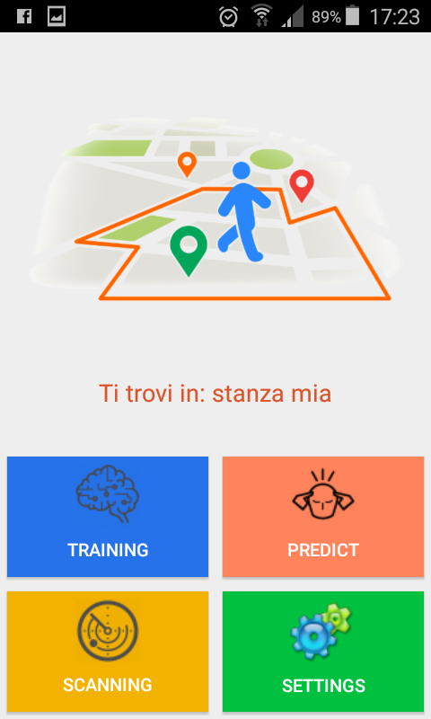

# FenceIndoor
..explained in three simple steps:

<br>
<table border="0" width="100%">
<tr><td>
<a href="Screenshots/step1.png"></a>
</td><td valign=top>
Step 1:<br>
Select the area you are in and capture all WiFi signals around device
</td></tr>
<tr><td>
<a href="Screenshots/step2.png"></a>
</td><td valign=top>
Step 2:<br>
Train the artificial neural network with the collected data
</td></tr>
<tr><td>
<a href="Screenshots/step3.png"></a>
</td><td valign=top>
Step 3:<br>
As you move the neural network will make a prediction of the area you are in, 
depending on the wifi signals caught around the device
</td></tr>
</table>
<br>

## Sceenshots:

<br>
<table border="0" width="100%">
<tr><td>
<a href="Screenshots/home.png"></a>
</td><td>
<a href="Screenshots/areaList.png"></a>
</td><td>
<a href="Screenshots/wifiScans.png"></a>
</td><td>
<a href="Screenshots/predict.png"></a>
</td></tr>
</table>
<br><br>

<br>


# Installation:

## Installation Mobile App:

From the project directory..

### Build android app:

if you use AndroidStudio 
open project folder "FenceIndoorApp"

..otherwise use following command:

```
cd FendeIndoorApp
./gradlew build
```

### Generate apk:

for generate apk still use gradle wrapper:
```
cd FendeIndoorApp
./gradlew assemble
```

made apk to the path:

```
./FendeIndoorApp/app/build/outputs/apk/app-release-unsigned.apk
```
rename it and transfer it into your mobile device


## Start server in the local machine:

### prerequisites:
- mongodb
- python3 and pip

### install following python packages:

```
pip install flask
pip install pymongo
pip install numpy
pip install sklearn
pip install petl
pip install tensorflow
pip install keras
```

### start mongodb (default is localhost:27017)
```
mongod
```

### Start the server
```
cd FenceIndoorServer
python fenceIndoor.py
```

## Start server by docker:

### prerequisites:
- docker (1.6.0 or above)
- docker-compose (1.3.1+)
- python 3.0 or above

### set configuration:

into the config.yml file, set property:
```
docker=True
```

### execute following commands:
```
docker-compose build
docker-compose up
```

You can go to the browser and open the url 
```
http://localhost:8090/ping 
```
to see the "it works" message into browser 


